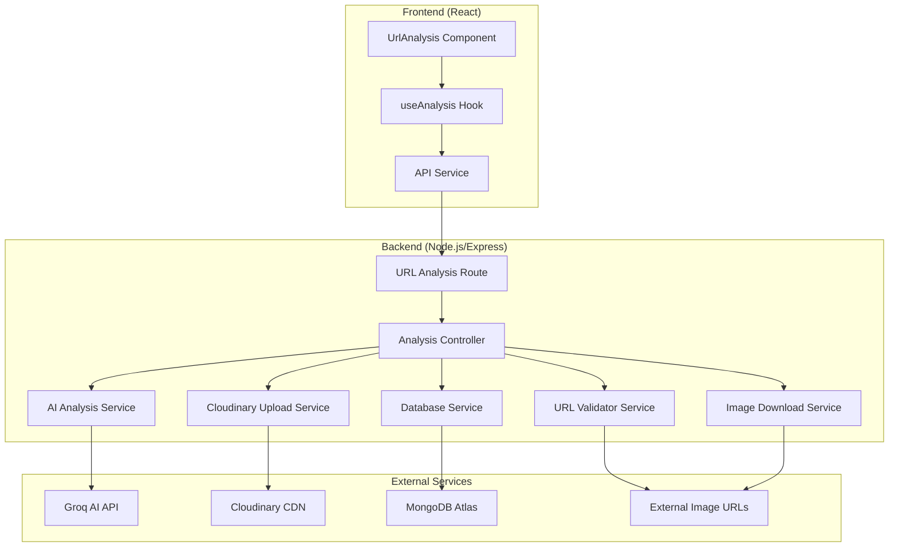

# Design Document: URL-based Food Image Analysis

## Overview

The URL-based food image analysis feature extends the existing Food-AI application by enabling users to analyze food images directly from URLs. This feature integrates seamlessly with the current React frontend and Node.js backend architecture, leveraging the existing Groq AI analysis pipeline, MongoDB storage, and Cloudinary image hosting.

The design maintains consistency with the existing upload-based analysis while adding robust URL validation, multi-strategy image downloading with fallbacks, and comprehensive error handling. The implementation follows the established patterns in the codebase, ensuring maintainability and consistency.

## Architecture

The URL analysis feature follows the existing three-tier architecture:



The design leverages the existing service layer pattern, with new services for URL validation and enhanced image downloading that complement the current `aiAnalysis.js` and `cloudinaryUpload.js` services.

## Components and Interfaces

### Frontend Components

**UrlAnalysis Component**
- Extends the existing component pattern established by `ImageUpload`
- Provides URL input field with real-time validation feedback
- Integrates with the existing `useAnalysis` hook for state management
- Maintains visual consistency with the current UI design

**Enhanced useAnalysis Hook**
- Already supports URL analysis through existing `handleAnalysisComplete` and `handleAnalysisError` methods
- No modifications needed - the hook abstracts analysis type from the UI

### Backend Services

**URL Validator Service** (New)
```javascript
interface URLValidator {
  validateFormat(url: string): ValidationResult
  validateAccessibility(url: string): Promise<AccessibilityResult>
  checkSecurityRestrictions(url: string): SecurityResult
}
```

**Enhanced Image Download Service**
- Extends existing `imageDownload.js` with additional fallback strategies
- Implements security checks for internal network protection
- Adds comprehensive error categorization and user-friendly messaging

**Analysis Controller** (Enhanced)
- Builds upon existing `analyzeImageFromUrl` method
- Integrates new validation and security services
- Maintains consistency with existing `processImageAnalysis` function

### API Interfaces

**URL Analysis Endpoint**
```
POST /analyze-url
Content-Type: application/json

Request:
{
  "imageUrl": "https://example.com/food-image.jpg"
}

Response (Success):
{
  "message": "URL Analyzed",
  "filename": "URL: https://example.com/food-image.jpg",
  "size": 245760,
  "image_url": "https://res.cloudinary.com/...",
  "source_url": "https://example.com/food-image.jpg",
  "analysis": {
    "food": "grilled salmon with vegetables",
    "health": "healthy",
    "reason": "High in protein and omega-3 fatty acids",
    "nutritionist_advice": "Excellent balanced meal",
    "next_meal": "Light fruit or yogurt for dessert"
  }
}

Response (Error):
{
  "error": "Failed to download image from URL",
  "details": "Connection timed out",
  "suggestion": "Try uploading the image directly instead"
}
```

## Data Models

The existing `Meal` model already supports URL-based analysis with the `source_url` field:

```javascript
const MealSchema = new mongoose.Schema({
    filename: String,           // "URL: https://example.com/image.jpg"
    food: String,              // AI analysis result
    health: String,            // "healthy" | "moderate" | "unhealthy"
    reason: String,            // AI explanation
    next_meal: String,         // AI recommendation
    size: Number,              // Downloaded image size in bytes
    image_url: String,         // Cloudinary URL for processed image
    source_url: String,        // Original URL (for URL-based analyses)
    created_at: { type: Date, default: Date.now }
});
```

No schema changes are required - the existing model fully supports the URL analysis feature.

## Correctness Properties

*A property is a characteristic or behavior that should hold true across all valid executions of a system-essentially, a formal statement about what the system should do. Properties serve as the bridge between human-readable specifications and machine-verifiable correctness guarantees.*
### Property 1: URL Format Validation
*For any* string input, the URL validator should correctly identify valid URLs and reject invalid formats with descriptive error messages
**Validates: Requirements 1.1, 1.2, 1.3**

### Property 2: Image Download with Fallbacks
*For any* valid image URL, the download service should attempt multiple download strategies and return appropriate errors when all methods fail
**Validates: Requirements 2.1, 2.2, 2.5**

### Property 3: Content Type Validation
*For any* downloaded content, the analyzer should correctly identify valid image formats and reject non-image content with appropriate errors
**Validates: Requirements 3.1, 3.2, 3.3**

### Property 4: Image Format Support
*For any* common image format (JPEG, PNG, WebP, GIF), the analyzer should successfully process the image for analysis
**Validates: Requirements 3.4**

### Property 5: Size Limit Handling
*For any* image exceeding size limits, the analyzer should gracefully reject it with descriptive error messages
**Validates: Requirements 3.5**

### Property 6: AI Analysis Consistency
*For any* valid image, the AI analysis pipeline should produce equivalent results regardless of whether the image was uploaded or downloaded from a URL
**Validates: Requirements 4.4, 4.5**

### Property 7: AI Analysis Error Handling
*For any* AI analysis failure, the system should return appropriate error messages while maintaining system stability
**Validates: Requirements 4.3**

### Property 8: Database Storage Consistency
*For any* successful analysis, the meal storage should save records with consistent schema whether from upload or URL, including source URL for URL-based analyses
**Validates: Requirements 5.1, 5.2, 5.4**

### Property 9: Storage Failure Resilience
*For any* database storage failure, the system should still return analysis results with appropriate warnings
**Validates: Requirements 5.3**

### Property 10: Meal History Completeness
*For any* meal history query, the results should include both uploaded and URL-based meals in chronological order
**Validates: Requirements 5.5**

### Property 11: Error Message Quality
*For any* network or access error, the system should return user-friendly error messages with specific guidance
**Validates: Requirements 6.1, 6.2, 6.3**

### Property 12: Timeout Handling
*For any* URL processing request, the system should implement appropriate timeouts and handle them gracefully
**Validates: Requirements 7.1**

### Property 13: Fallback Sequence Optimization
*For any* failed primary download method, the system should attempt fallback methods in the optimal order
**Validates: Requirements 7.2**

### Property 14: Rate Limiting Enforcement
*For any* series of requests from the same source, the system should enforce rate limits to prevent abuse
**Validates: Requirements 7.4**

### Property 15: Internal Network Protection
*For any* URL pointing to internal network resources (localhost, private IP ranges), the validator should reject it for security
**Validates: Requirements 8.1**

### Property 16: Security Header Implementation
*For any* image download request, the system should implement appropriate security headers and restrictions
**Validates: Requirements 8.2**

### Property 17: Input Sanitization
*For any* URL input, the system should properly sanitize the input before processing to prevent injection attacks
**Validates: Requirements 8.4**

### Property 18: Malicious Content Detection
*For any* detected malicious content or suspicious patterns, the system should block processing and apply appropriate security measures
**Validates: Requirements 8.3, 8.5**

## Error Handling

The URL analysis feature implements comprehensive error handling at multiple layers:

### Validation Layer Errors
- **Invalid URL Format**: Returns HTTP 400 with specific format guidance
- **Internal Network URLs**: Returns HTTP 403 with security explanation
- **Malicious Patterns**: Returns HTTP 403 with security warning

### Download Layer Errors
- **Network Timeouts**: Implements retry logic with exponential backoff
- **CORS Restrictions**: Attempts alternative download strategies
- **Server Errors**: Provides specific HTTP status code explanations
- **Connection Failures**: Returns user-friendly connectivity guidance

### Content Validation Errors
- **Non-Image Content**: Returns HTTP 400 with content type explanation
- **Unsupported Formats**: Returns HTTP 400 with supported format list
- **Oversized Images**: Returns HTTP 413 with size limit information

### AI Analysis Errors
- **API Failures**: Returns fallback analysis with error indication
- **Processing Errors**: Maintains system stability with graceful degradation
- **Rate Limiting**: Returns HTTP 429 with retry guidance

### Storage Errors
- **Database Failures**: Returns analysis results with storage warning
- **Connection Issues**: Logs errors but doesn't fail the analysis request

All errors include:
- User-friendly error messages
- Specific guidance for resolution
- Suggestions for alternative actions (e.g., "Try uploading the image directly")
- Appropriate HTTP status codes
- Detailed logging for debugging

## Testing Strategy

The URL analysis feature employs a dual testing approach combining unit tests for specific scenarios and property-based tests for comprehensive validation.

### Property-Based Testing

Property-based tests validate universal correctness properties using **fast-check** library for JavaScript. Each property test runs a minimum of 100 iterations with randomized inputs to ensure comprehensive coverage.

**Configuration:**
- Library: fast-check (JavaScript property-based testing)
- Iterations: 100 minimum per property test
- Test tagging format: **Feature: url-image-analysis, Property {number}: {property_text}**

**Property Test Categories:**
1. **Input Validation Properties**: Test URL format validation, security checks, and input sanitization
2. **Download Behavior Properties**: Test fallback mechanisms, timeout handling, and error responses
3. **Content Processing Properties**: Test image format validation, size limits, and content type checking
4. **Analysis Consistency Properties**: Test equivalence between upload and URL analysis results
5. **Storage Properties**: Test database consistency, error resilience, and history completeness
6. **Security Properties**: Test internal network protection, malicious content detection, and rate limiting

### Unit Testing

Unit tests complement property tests by focusing on:

**Specific Examples:**
- Valid URL formats (HTTP, HTTPS with various domains)
- Common error scenarios (404, 403, timeout)
- Supported image formats (JPEG, PNG, WebP, GIF)
- Edge cases (empty URLs, malformed URLs, extremely long URLs)

**Integration Points:**
- API endpoint behavior with various request formats
- Database interaction with different connection states
- External service integration (Groq AI, Cloudinary)
- Frontend component interaction with backend services

**Error Conditions:**
- Network connectivity failures
- Service unavailability scenarios
- Invalid authentication states
- Resource exhaustion conditions

### Test Organization

```
tests/
├── unit/
│   ├── services/
│   │   ├── urlValidator.test.js
│   │   ├── imageDownload.test.js
│   │   └── analysisController.test.js
│   └── routes/
│       └── urlAnalysis.test.js
└── property/
    ├── urlValidation.property.test.js
    ├── downloadBehavior.property.test.js
    ├── contentValidation.property.test.js
    ├── analysisConsistency.property.test.js
    ├── storageConsistency.property.test.js
    └── securityValidation.property.test.js
```

**Test Data Management:**
- Mock external services (Groq AI, Cloudinary) for consistent testing
- Use test image URLs with predictable responses
- Implement test database with isolated collections
- Generate realistic test data for property tests

**Coverage Requirements:**
- Unit tests: Focus on specific examples and integration points
- Property tests: Ensure universal properties hold across all valid inputs
- Combined coverage: Validate both concrete behavior and general correctness
- Error path coverage: Test all error conditions and recovery mechanisms