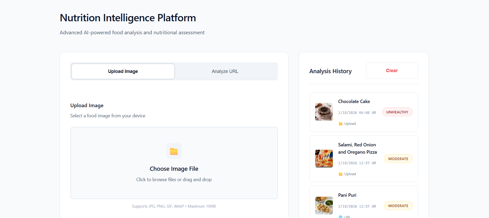
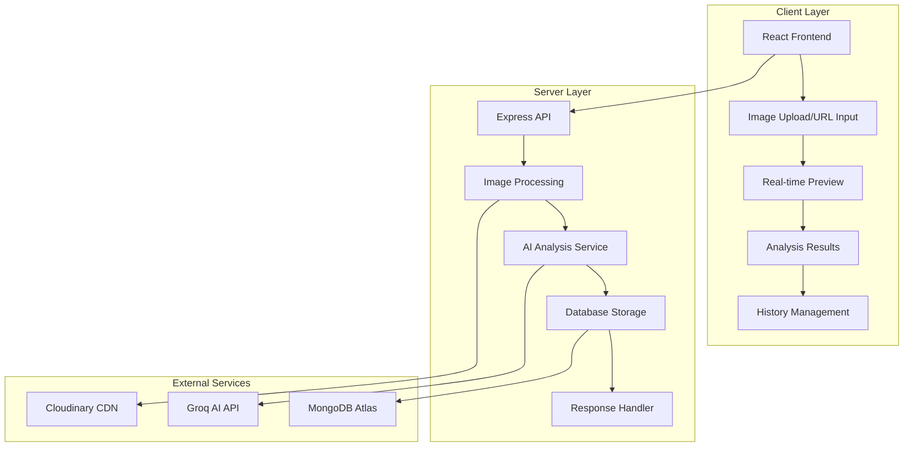

# 🍽️ Food AI - Intelligent Food Analysis Platform

<div align="center">



**AI-powered food image analysis for nutritional insights and meal recommendations**

[](https://food-ai-analysis.vercel.app)
[](https://drive.google.com/file/d/1lPCXU7kt9ujo513_z8L3Va_wt67i-IA4/view?usp=sharing)
[](https://food-ai-backend-sxha.onrender.com)

</div>

## 🌟 Features

- **🖼️ Multi-Input Analysis**: Upload food images or analyze from URLs
- **🤖 AI-Powered Recognition**: Advanced food identification with health ratings
- **📊 Nutritional Insights**: Detailed health analysis and reasoning
- **📱 Real-Time Preview**: Live image preview with analysis progress
- **📚 Meal History**: Persistent storage of past analyses with search
- **🎨 Responsive Design**: Seamless experience across all devices
- **⚡ Fast Processing**: Optimized for quick analysis and results

## 🛠️ Tech Stack

| Category | Technologies |
|----------|-------------|
| **Frontend** | React 19, Modern CSS3, Responsive UI |
| **Backend** | Node.js, Express.js, RESTful API |
| **Database** | MongoDB with Mongoose ODM |
| **AI Services** | Groq API (Vision & Analysis) |
| **Cloud Storage** | Cloudinary (Image CDN) |
| **Deployment** | Vercel (Frontend), Render (Backend) |

## 🏗️ Architecture



## 🚀 Quick Start

### Prerequisites

Before you begin, ensure you have the following installed:

- **Node.js** (v16.0.0 or higher) - [Download here](https://nodejs.org/)
- **npm** (v7.0.0 or higher) - Comes with Node.js
- **Git** - [Download here](https://git-scm.com/)

### 📥 Installation

1. **Clone the repository**
   ```bash
   git clone https://github.com/yourusername/food-ai-platform.git
   cd food-ai-platform
   ```

2. **Install all dependencies** (Root, Server, and Client)
   ```bash
   # Install root dependencies
   npm install
   
   # Install all project dependencies at once
   npm run install-all
   ```
   
   Or install manually:
   ```bash
   # Install server dependencies
   cd server
   npm install
   
   # Install client dependencies
   cd ../client
   npm install
   
   # Return to root
   cd ..
   ```

### 🔧 Environment Configuration

1. **Backend Environment Setup**
   ```bash
   cd server
   cp .env.example .env
   ```

2. **Configure your `.env` file** with the following variables:
   ```env
   # Required API Keys
   GROQ_API_KEY=your_groq_api_key_here
   MONGO_URI=your_mongodb_connection_string
   
   # Cloudinary Configuration
   CLOUDINARY_CLOUD_NAME=your_cloudinary_cloud_name
   CLOUDINARY_API_KEY=your_cloudinary_api_key
   CLOUDINARY_API_SECRET=your_cloudinary_api_secret
   
   # Optional Configuration
   PORT=5000
   NODE_ENV=development
   ```

3. **Get Required API Keys:**

   **Groq API Key:**
   - Visit [Groq Console](https://console.groq.com/)
   - Sign up/Login and create a new API key
   - Copy the key to your `.env` file

   **MongoDB URI:**
   - Create account at [MongoDB Atlas](https://www.mongodb.com/atlas)
   - Create a new cluster and get connection string
   - Replace `<password>` with your database password

   **Cloudinary Credentials:**
   - Sign up at [Cloudinary](https://cloudinary.com/)
   - Get your Cloud Name, API Key, and API Secret from dashboard
   - Add them to your `.env` file

### 🏃‍♂️ Running the Application

#### Option 1: Run Both Services Simultaneously (Recommended)
```bash
# From the root directory
npm run dev
```

#### Option 2: Run Services Separately

**Terminal 1 - Backend Server:**
```bash
cd server
npm start
# Server runs on http://localhost:5000
```

**Terminal 2 - Frontend Client:**
```bash
cd client
npm start
# Client runs on http://localhost:3000
```

### 🌐 Access the Application

- **Frontend**: http://localhost:3000
- **Backend API**: http://localhost:5000
- **API Health Check**: http://localhost:5000/

## 📋 Available Scripts

### Root Directory
```bash
npm run dev          # Run both client and server concurrently
npm run server       # Run only the backend server
npm run client       # Run only the frontend client
npm run install-all  # Install dependencies for all packages
```

### Server Directory
```bash
npm start           # Start the production server
npm run dev         # Start server with nodemon (development)
npm test           # Run server tests
```

### Client Directory
```bash
npm start          # Start development server
npm run build      # Build for production
npm test          # Run client tests
npm run eject     # Eject from Create React App (irreversible)
```

## 🔌 API Documentation

### Base URL
- **Development**: `http://localhost:5000`
- **Production**: `https://food-ai-backend-sxha.onrender.com`

### Endpoints

| Method | Endpoint | Description | Request Body |
|--------|----------|-------------|--------------|
| `GET` | `/` | Health check | None |
| `POST` | `/upload` | Analyze uploaded image | `multipart/form-data` with image file |
| `POST` | `/analyze-url` | Analyze image from URL | `{"imageUrl": "https://example.com/image.jpg"}` |
| `GET` | `/history` | Get analysis history | None |
| `DELETE` | `/history` | Clear all history | None |

### Response Format
```json
{
  "message": "Analysis completed",
  "filename": "food-image.jpg",
  "size": 245760,
  "image_url": "https://res.cloudinary.com/...",
  "analysis": {
    "food": "Grilled salmon with vegetables",
    "health": "healthy",
    "reason": "High in protein and omega-3 fatty acids",
    "nutritionist_advice": "Excellent balanced meal",
    "next_meal": "Light fruit or yogurt for dessert"
  }
}
```

## 🚀 Deployment

### Frontend Deployment (Vercel)

1. **Build the project**
   ```bash
   cd client
   npm run build
   ```

2. **Deploy to Vercel**
   - Connect your GitHub repository to Vercel
   - Set build command: `npm run build`
   - Set output directory: `build`
   - Set environment variable: `REACT_APP_API_URL=your_backend_url`

### Backend Deployment (Render)

1. **Prepare for deployment**
   - Ensure all environment variables are set in Render dashboard
   - Use `npm start` as the start command
   - Set Node.js version in `package.json` if needed

2. **Environment Variables on Render**
   ```
   GROQ_API_KEY=your_groq_api_key
   MONGO_URI=your_mongodb_uri
   CLOUDINARY_CLOUD_NAME=your_cloud_name
   CLOUDINARY_API_KEY=your_api_key
   CLOUDINARY_API_SECRET=your_api_secret
   NODE_ENV=production
   ```

## 🧪 Testing

```bash
# Run all tests
npm test

# Run server tests only
cd server && npm test

# Run client tests only
cd client && npm test

# Run tests with coverage
npm test -- --coverage
```

## 🔧 Troubleshooting

### Common Issues

**Port Already in Use:**
```bash
# Kill process on port 3000 or 5000
npx kill-port 3000
npx kill-port 5000
```

**Module Not Found:**
```bash
# Clear npm cache and reinstall
npm cache clean --force
rm -rf node_modules package-lock.json
npm install
```

**Environment Variables Not Loading:**
- Ensure `.env` file is in the `server` directory
- Check that variable names match exactly
- Restart the server after changes

**Database Connection Issues:**
- Verify MongoDB URI format
- Check network access in MongoDB Atlas
- Ensure IP address is whitelisted

## 🤝 Contributing

1. Fork the repository
2. Create your feature branch (`git checkout -b feature/AmazingFeature`)
3. Commit your changes (`git commit -m 'Add some AmazingFeature'`)
4. Push to the branch (`git push origin feature/AmazingFeature`)
5. Open a Pull Request

## 📄 License

This project is licensed under the MIT License - see the [LICENSE](LICENSE) file for details.

## 🙏 Acknowledgments

- [Groq](https://groq.com/) for AI analysis capabilities
- [Cloudinary](https://cloudinary.com/) for image storage and processing
- [MongoDB](https://www.mongodb.com/) for database services
- [React](https://reactjs.org/) for the frontend framework

## 📞 Support

If you encounter any issues or have questions:

- 📧 **Email**: your-email@example.com
- 🐛 **Issues**: [GitHub Issues](https://github.com/yourusername/food-ai-platform/issues)
- 📖 **Documentation**: [Wiki](https://github.com/yourusername/food-ai-platform/wiki)

---

<div align="center">

**Made with ❤️ for better nutrition awareness**

[](https://food-ai-analysis.vercel.app)

</div>